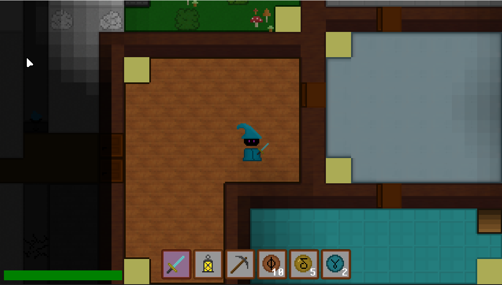
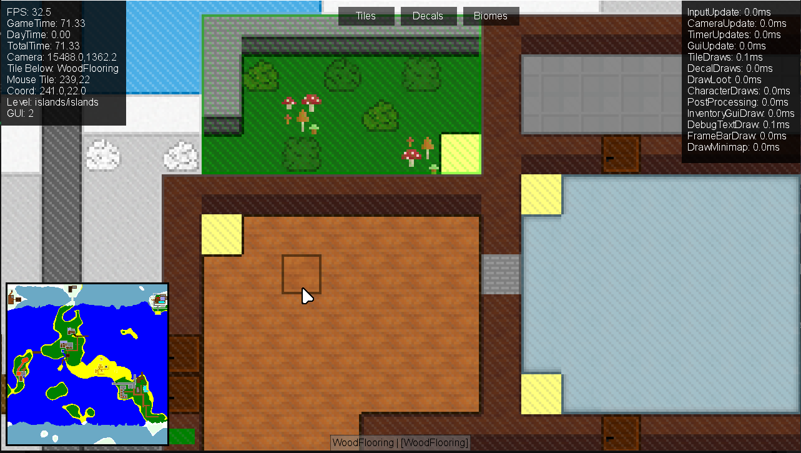

# Quest

**Quest** is a pixel art tile-based adventure game built with a custom engine. It comes with the game, a level editor, and a code generator.



## Game Features

- **Tile-Based World**  
  Fully customizable grid-based maps with support for different terrain, structures, biomes, loot, and NPCs.

- **Connected Textures**  
  Tiles use a simple tileset to create visually appealing connected textures while staying in the pixel art style.

- **NPCs**  
  Non-playable characters with custom dialog, shop options, and textures can be placed in the world.

- **Loot**  
  Floor loot can be picked up by the player and stored in an inventory.

- **Biomes and Weather**  
  A dynamic gradient weather system that changes based on the biome the player is in.

- **Saves**  
  The game supports saving and loading player progress.

- **Optimized Performance**  
  The game runs very fast on any computer and uses up little memory.

## Getting Started

### Prerequisites

- [.NET](https://dotnet.microsoft.com/)
- [MonoGame](https://www.monogame.net/)
- Monogame Extended

### Running the Game
Clone the repository:
   ```bash
   git clone https://github.com/Nektarios1667/Quest.git
   cd Quest
   ```

## Level Editor
The level editor allows you to create and modify game levels with ease.


### Running the Level Editor
The level editor is included in the same project as the game. To run it, run the game with the argument `--level-editor`.

### Controls
- **Camera**  
`W`, `A`, `S`, `D` or `Arrow Keys` to pan the camera around the level. Use `Left Alt` to increase pan speed.
- **Tools**  
`Left Mouse Button` to draw the selected tile, biome, or decal at the mouse position.
`Middle Mouse Button` to pick the tile, biome, or decal at the mouse position.
- **Shortcuts**  
    - `1`, `2`, `3` to switch between tile, biome, and decal tools.  
    - `[` and `]` or `Mouse Wheel` to change the selected tile, biome, or decal.  
    - `Ctrl + O` to open a level.  
    - `Ctrl + F` to flood fill the current tile, biome, or decal.  
    - `Ctrl + S` to export the current level.  
    - `Ctrl + N` to make a new NPC.  
    - `Ctrl + Shift + L` to delete an NPC.  
    - `Ctrl + L` to create a new Loot.  
    - `Ctrl + Shift + L` to delete a Loot.  
    - `Ctrl + D` to create a new Decal.  
    - `Ctrl + Shift + D` to delete a Decal.  
    - `Ctrl + S` to set the level spawn to the mouse position.  
    - `Ctrl + T` to set the level tint.  
    - `Ctrl + G` to generate a new level.  
    - `Ctrl + R` to resave the level. This will not write any current changes to disk.  
    - `Ctrl + Shift + R` to resave the world. This will not write any current changes to disk.  


### Tools
- **Tool Selection**  
Switch between tile, biome, and decal tools using the buttons at the top of the screen or by pressing `1`, `2`, or `3`.
- **Tile Palette**  
Select tiles from the palette to place them in the level. The selected tile can be changed with `mouse wheel` or `[` and `]`.
- **Biome Palette**  
Select biomes from the palette to paint them in the level. The selected biome can be changed with `mouse wheel` or `[` and `]`.
- **Decal Palette**  
Select decals from the palette to place them in the level. The selected decal can be changed with `mouse wheel` or `[` and `]`.
- **Use Tool**  
`Left Mouse Button` to use the selected tool at the mouse position.
- **Pick Tool**  
`Mouse Button 3` to pick the tile, biome, or decal at the mouse position.
- **Mouse Menu**  
`Mouse Button 2` to open the mouse menu for additional options like exporting levels and editing tiles.

### Levels (.qlv)
- **Opening Levels**  
Use the mouse menu or hotkey to open the level open dialog. Then enter the name of the level as `worldName/levelName`.
- **Exporting Levels**  
Use the mouse menu or hotkey to save the current level. When saving the level, specify only the level name. The world name is determined by the current open world.  
- **Sharing Worlds**  
To share a world, share the entire folder located in `GameData/Worlds/yourWorldName`. This folder contains all levels, loot tables, and saves for that world.  

## GameData Files

### Terrain Files (.qtr)
- **Overview**  
Terrain files define behavior for terrain generated with the level generator. They are located in `GameData/Terrain`.  
More documentation for the file format can be found in `GameData/Docs/Quest Terrain Files.txt`.  
- **Structure**  
They are written in binary format and can be edited with a hex editor or a custom tool. 
Each entry in them defines a range of noise values and the corresponding tile type to use for that range.  

### Structure Files (.qst)
- **Overview**  
Structure files define pre-built structures that are placed in levels generated with the level generator. They are located in `GameData/Structures`.  
More documentation for the file format can be found in `GameData/Docs/Quest Structure Files.txt`.  
- **Structure**  
Structure files are stored in binary format and can be edited with a hex editor or a custom tool.  
They store the width and height of the structure with a byte each, and for each tile a byte representing the tile type.  

### Key Value Files (.qkv)
- **Overview**  
Key Value files are generice files that store key-value pairs. They are used for game data that should generally not be modified.  
More documentation for the file format can be found in `GameData/Docs/Quest Key Value.txt`.  
- **Structure**  
Key Value files are stored in binary format and can be edited with a hex editor or a custom tool.  
They contain a UInt16 representing the number of entries, followed by each entry consisting of a key string and a value string.  

### Loot Table Files (.qlt)
- **Overview**  
Loot Table files define loot that can be spawned in levels. They are located in `GameData/LootTables`.  
More documentation for the file format can be found in `GameData/Docs/Quest Loot Table Files.txt`.  
The code generator (see next section) can be used to create and edit loot tables more easily.  
- **Structure**  
Loot Table files are stored in binary format and can be edited with a hex editor or a custom tool.  
They contain a byte representing the number of loot entries, followed by each entry consisting of an item ID byte, percent chance byte, min quantity byte, and max quantity byte.  

### Loot Preset Files (.qlp)
- **Overview**  
Loot Preset files define preset loot configurations that can be used in loot tables. They are located in `GameData/Worlds/yourWorldName/loot`.  
More documentation for the file format can be found in `GameData/Docs/Quest Loot Preset Files.txt`.  
- **Structure**  
Loot Preset files are stored in binary format and can be edited with a hex editor or a custom tool.  
They contain a width and height byte, followed by a itemID byte and amount byte for each slot.  
The code generator (see next section) can be used to create and edit loot tables more easily.  

### Level Files (.qlv)
- **Overview**  
Level files store the data for each level in the game. They are located in `GameData/Worlds/yourWorldName/levels`.  
More documentation for the file format can be found in `GameData/Docs/Quest Level Files.txt`.  
- **Structure**  
Level files are stored in binary format and compressed, making them difficult to edit manually.  
The level editor should be used to create and modify levels.  

### Save files (.qsv)
- **Overview**  
Save files store player progress and are located in `GameData/Worlds/yourWorldName/saves`.  
More documentation for the file format can be found in `GameData/Docs/Quest Save Files.txt`.  
- **Structure**  
Loot Preset files are stored in binary format.  
It is not recommended to edit save files manually as they contain important player data.  

## Source Code

### Content  
- All content is stored in their respective folders in `/Content`.
- Textures must be in the `TextureID` enum in `Texture.cs` to be used in the game.
- They must also be loaded in the `LoadTextures` method in `TextureManager.cs` along with their metadata.
- It is recommended for fonts to be stored as variables in `TextureManager.cs` for easy access.

### Managers
- Most game logic is handled by manager classes in the `/Managers` folder.
- Managers handle things like rendering, input, level loading, entity management, etc.
- Managers can be modified to change game behavior or add new features.
- New managers can be added for additional functionality.

### Tiles
- Tiles are defined in the `TileTypeID` enum and the `TileTypes` class in `Tile.cs`.
- Tiles also have their own classes in the `/Tiles` folder that inherits from `Tile`.
- Each tile has properties such as texture and walkability.
- Custom tile behavior can be added by modifying the custom tile's class in `/Tiles`.
- Tiles can have custom `OnPlayerCollide` methods for more complex behavior.

### Decals
- Decals are defined in the `DecalTypeID` enum in `Decal.cs`.  
- Decals have their own classes in the `/Decals` folder that inherits from `Decal`.
- Custom decal behavior can be added by modifying the custom decal's class in `/Decals`.

### Items
- Items are defined in the `ItemTypeID` enum and the `ItemTypes` class in `Item.cs`.
- Items also have their own classes in the `/Items` folder that inherits from `Item`.
- If the item is meant to give off light, it should inherit from `Light` instead.
- Custom item behavior can be added by modifying the custom item's class in `/Items`.
- Each item has `PrimaryUse` and `SecondaryUse` methods that can be overridden for custom behavior.

### Utilities
- Some useful extnesions, methods, and functions are in the classes in the `/Utilities` folder.
- These can be used throughout the codebase for common tasks.

### Constants
- Constants for the game, rendering, settings, etc are stored in `Constants.cs`.
- Variables like window size and player movement speed can easily be modifed.
- Any changes will be reflected throughout the code.
- Debug flags such as `TEXT_INFO` can also be used to show/hide realtime debug info.
- **Warning: Some constants may be used for important rendering and calulations. Changing these can break game code.**
 
## Code Generator
The code generator is a tool that helps create repetitive code and files.  
It is included in the same project as the game and can be run with the argument `--code-generator`.  
### Tile
By entering `t` the tile generator can be used to create new tile types.  
Answer prompts and the generator will write and modify the necessary files.  
Some custom functionality may need to be added manually.  
### Decal
By entering `d` the decal generator can be used to create new decal types.  
Answer prompts and the generator will write and modify the necessary files.  
### Item
By entering `i` the item generator can be used to create new item types.  
Answer prompts and the generator will write and modify the necessary files. 
### Loot Table
By entering `l` the loot table generator can be used to create new loot table files.  
Answer prompts and the generator will write the necessary files.  
### Weather Test
By entering `w` the weather test generator can be used to test the current weather system.  
Results will be printed out and a graph will be outputted to the bin folder.  

## Quill Language

### Overview
Quill is a interpreted scripting language for use in Quest levels.  
It is very simple and is still in early development.  

### Commands
Each line of code (other than comments) represents a command.  
Commands can have parameters separated by commas.  
Comments start with `//` and make the entire line ignored.  
Arguments are separated by commas, except for control flow commands which seperate parts by spaces.

`(value)` denotes a parameter that must be provided.  
`[value]` denotes an optional paramter.  
`.label` denotes an optional label for control flow commands. The labels are used when nesting flow commands to ensure the correct block is ended.  
The following commands are currently supported:  
- `if [.label] (condition)` - runs the following block if the condition is true
- `endif [.label]` - ends an if block
- `while [.label] (condition)` - runs the following block while the condition is true
- `endwhile [.label]` - ends a while block
- `breakwhile [.label]` - breaks out of the current while loop
- `str (name), (value)` - creates a string variable
- `num (name), (value)` - creates a number variable
- `func (name)` - creates a function
- `endfunc` - ends a function definition
- `call (name)` - calls a function
- `sleep (milliseconds)` - pauses execution for the specified time
- `wait (condition), (recheck milliseconds) ` - pauses execution until the condition is true; rechecks every specified milliseconds

### Builtin Functions
The following are builtin functions that can be called just like commands:  
- `contains (array / 2d-array), (target)` - checks if the array contains a specific value
- `error (message), (exit)` - prints an error message and optionally exits the script
- `execute (command)` - executes a console command
- `getitem (array), (index)` - gets an item from an array at the specified index
- `getitem2d (2d-array), (x), (y)` - gets an item from a 2d array at the specified coordinates
- `give (item,) (amount)` - gives the player a specific item and amount
- `loadlevel (levelName)` - loads a specific level
- `log (message)` - prints a message to the console
- `readfile (filePath)` - reads the contents of a file
- `readlevel (levelName)` - reads the data of a specific level
- `teleport (x), (y)` - teleports the player to the specified coordinates
- `unloadlevel (levelName)` - unloads a specific level
- `warn (message)` - prints a warning message to the console
- `notif (r), (g), (b), (duration seconds), (message)` - shows a notification on screen with the specified color and duration

### Quest Engine Integration
Quest Engine provides additional variables that can be accessed in Quill scripts.  
It is recommended to check in the beginning of the script if the symbol system is ready using `<ready>`.  
These include:
- `<playercoord_x>` – player tile X coordinate
- `<playercoord_y>` – player tile Y coordinate
- `<playercoord>` – player tile coordinates as a formatted string
- `<playerhealth>` – current player health
- `<playermaxhealth>` – maximum player health
- `<playerspeed>` – player movement speed constant
- `<isstuck>` – whether the tile below the player is not walkable (`true` / `false`)
- `<tilebelow>` – type of the tile directly below the player, or `NUL` if none
- `<camera_x>` – camera X position
- `<camera_y>` – camera Y position
- `<camera>` – camera position formatted as `x;y`
- `<currentlevel>` – name of the current level
- `<currentworld>` – name of the current world
- `<spawn>` – spawn point coordinates of the current level
- `<gametime>` – current game time
- `<daytime>` – current in-game daytime value
- `<totaltime>` – total elapsed game time
- `<gamestate>` – current game state
- `<inventoryitems>` – list of inventory item names as a `2d-array`
- `<inventoryamounts>` – list of inventory item amounts as a `2d-array`
- `<inventorysize_x>` – inventory width
- `<inventorysize_y>` – inventory height
- `<inventorysize>` – inventory size formatted as `width;height`
- `<isinventoryopen>` – whether the inventory UI is open
- `<equippedslot>` – index of the currently equipped slot
- `<equippeditem>` – name of the equipped item, or `NUL`
- `<equippeditemuid>` – unique ID of the equipped item, or `-1` if none
- `<equippeditemamount>` – amount of the equipped item, or `0` if none
- `<ready>` – indicates the symbol system is initialized
- `<fps>` – current frames per second
- `<deltatime>` – delta time for the current frame
- `<ispaused>` – whether the game is currently paused
- `<vsync>` – whether VSync is enabled
- `<resolution_x>` – screen resolution width
- `<resolution_y>` – screen resolution height
- `<resolution>` – screen resolution formatted as `width;height`
- `<fpslimit>` – FPS limit setting


### Language
Variables can be accessed with `=variableName`.  
Arrays are stored as strings with values separated by `;`.  
2D-arrays are stored as strings with rows separated by `/` and values in each row separated by `;`.  
Booleans are represented as `true` and `false`.  
Numbers can be integers or decimals.  
Strings must be enclosed in single quotes `'myString'`.  
Null values are represented as `'NUL'`.  
Values are returned from functions in the variable `[return]`.  
Expressions can be enclosed in curly braces `{5 * 5}` to be evaluated.  
Some functions automatically evaluate expressions passed as parameters.  

### Examples
```Quill
// Wait until the symbol system is ready
wait =<ready>, 1000

// Main loop
while .main true
	// Check for apple in inventory
	contains =<inventoryitems>, Apple

    // Achievement
	if =[return]
		notif 0, 255, 255, 10, Achievement:An apple a day...
		breakwhile
	endif

    // Check every second
	sleep 1000
endwhile .main
```